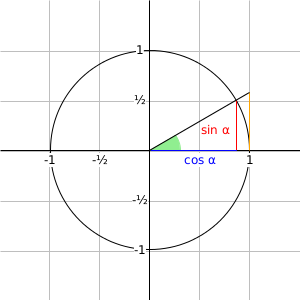

Additional tools for building pictures with the `slideshow/pict` library in
Racket. This library is mostly just for my own use in building diagrams for
talks and papers. Since the library is experimental and grows as I use it,
I can't guarantee a stable API.

The following libraries are included:
  * `pict-utils/calendar` - draws calendars
  * `pict-utils/constructors` - misc. pict constructors
  * `pict-utils/npict` - an experimental pict DSL
  * `pict-utils/ryb` - functions for using the RYB color space

---

The following example illustrates an example use of the `npict` library:

```racket
#lang racket

(require slideshow/pict
         pict-utils/constructors
         pict-utils/npict)

(define axis-label
  (style #:background-color "white"))
(define sin-style
  (style #:text-color "red"
         #:background-color "white"))
(define cos-style
  (style #:text-color "blue"
         #:background-color "white"))

(define main-diagram
  (npict (node #:name 'origin #:at (coord 0 0))
         ;; grid and axes
         (node #:at 'origin #:pict (colorize (grid 300 300 50 1) "gray"))
         (node #:at 'origin #:pict (hline 300 1))
         (node #:at 'origin #:pict (vline 1 300))
         ;; unit circle
         (node #:at 'origin #:pict (circle 200))
         ;; the interesting stuff
         (node #:at (align 'origin 'lb)
               #:pict
               (colorize
                (path (move-to 0 0)
                      (line-to 30 0)
                      (arc -30 -30 60 60 0 (degrees->radians 30))
                      (close))
                "lightgreen"))
         (let ([x (* 100 (cos (degrees->radians 30)))])
           (line #:from (coord x 0 'cb) #:to (coord x 50 'cb)
                 #:color "red"))
         (let ([x (* 100 (cos (degrees->radians 30)))])
           (line #:from (coord 0 0 'lc) #:to (coord x 0 'lc)
                 #:color "blue"))
         (let ([y (* 100 (tan (degrees->radians 30)))])
           (line #:from (coord 100 0 'cb) #:to (coord 100 y 'cb)
                 #:color "orange"))
         (line #:from (align 'origin 'cc)
               #:to (coord 100 (* 100 (tan (degrees->radians 30)))))
         ;; draw trig text
         (node #:at (coord 50 -10) #:style cos-style #:text "cos α")
         (node #:at (coord 65 20) #:style sin-style #:text "sin α")
         ;; draw labels
         (node #:at (coord -10 -100) #:style axis-label #:text "-1")
         (node #:at (coord -10 100)  #:style axis-label #:text "1")
         (node #:at (coord 100 -10)  #:style axis-label #:text "1")
         (node #:at (coord -100 -10) #:style axis-label #:text "-1")
         (node #:at (coord -10 -50)  #:style axis-label #:text "-½")
         (node #:at (coord -10 50)   #:style axis-label #:text "½")
         (node #:at (coord -50 -10)  #:style axis-label #:text "-½")))

main-diagram
```

The code produces the following picture:



This example mimics an example from the PGF/TikZ manual.

---

Copyright 2013 Asumu Takikawa

This program is free software: you can redistribute it and/or modify it under
the terms of the GNU General Public License as published by the Free Software
Foundation, either version 3 of the License, or (at your option) any later
version.

This program is distributed in the hope that it will be useful, but WITHOUT ANY
WARRANTY; without even the implied warranty of MERCHANTABILITY or FITNESS FOR A
PARTICULAR PURPOSE. See the GNU General Public License for more details.

You should have received a copy of the GNU General Public License along with
this program. If not, see http://www.gnu.org/licenses/.

